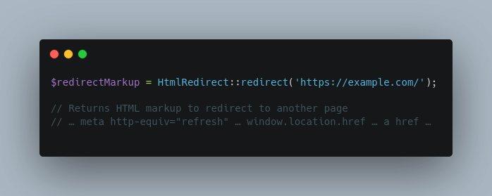

# HTML redirect

[](https://packagist.org/packages/pixelbrackets/html-redirect/)
[](https://gitlab.com/pixelbrackets/html-redirect/pipelines)
[](https://gitlab.com/pixelbrackets/html-redirect#requirements)
[](https://spdx.org/licenses/GPL-2.0-or-later.html)
[](https://gitlab.com/pixelbrackets/html-redirect/-/blob/master/CONTRIBUTING.md)

Generate HTML markup to redirect a request instead of sending a location header.



## Vision

The package provides valid HTML markup to redirect a request to another
location.

The redirect method is an alternative for generating static sites which may
not use a [location header](https://www.php.net/manual/en/function.header.php).

See [»Usage«](#usage) for an example.

The package follows the KISS principle.

## Requirements

* PHP

## Installation

Packagist Entry https://packagist.org/packages/pixelbrackets/html-redirect/

## Source

https://gitlab.com/pixelbrackets/html-redirect/

Mirror https://github.com/pixelbrackets/html-redirect/

## Demo

⌨️ [`php tests/demo.php`](tests/demo.php).

## Usage

1. Get the markup to redirect to `https://example.com` and write to file
   ```php
   $redirectMarkup = \Pixelbrackets\HtmlRedirect\HtmlRedirect::redirect('https://example.com/');
   file_put_contents('/var/www/example/index.html', $redirectMarkup);
   ```

The package creates the markup only, you need to write files or create PSR-7 
responses by yourself.

## License

GNU General Public License version 2 or later

The GNU General Public License can be found at http://www.gnu.org/copyleft/gpl.html.

## Author

Dan Untenzu (<mail@pixelbrackets.de> / [@pixelbrackets](https://pixelbrackets.de))

## Changelog

See [./CHANGELOG.md](CHANGELOG.md)

## Contribution

This script is Open Source, so please use, patch, extend or fork it.

[Contributions](CONTRIBUTING.md) are welcome!
